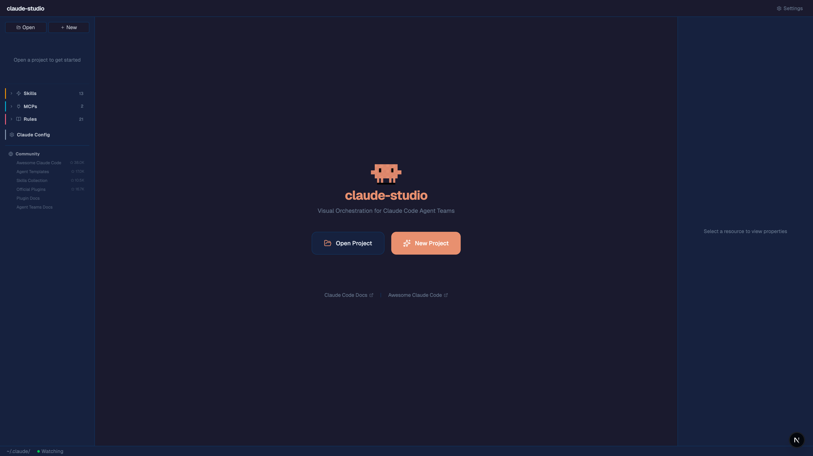

# cc-studio

Visual orchestration platform for Claude Code Agent Teams.

Design, manage, and execute multi-agent workflows through an intuitive DAG editor. Create agents, skills, and workflows — then run them with built-in execution engine.



## Features

- 🔀 **Visual Workflow Editor** — Drag-and-drop DAG editor with 4 edge types (dispatch / report / sync / roundtrip)
- 🤖 **Agent Management** — Create, edit, delete agents with 9 built-in templates
- ⚡ **Skill Management** — Create skills with templates, bind to agent nodes
- 🚀 **Execution Engine** — Run workflows with real-time status, checkpoint approval
- 🪄 **AI Generation** — Describe what you want, Claude generates workflow/agent/skill via `claude -p`
- 🔌 **MCP & Settings** — Visual config for MCP servers, hooks, permissions
- 📦 **Plugin Export** — Export project as standard Claude Code plugin package
- 🧠 **Memory Inspector** — Read-only view of project memories with delete capability
- 🎯 **CLAUDE.md Sync** — Workflows auto-sync to CLAUDE.md for Claude Code integration
- 🌐 **Community Links** — Live GitHub stars for awesome-claude-code, agent templates, skills collections

## Quick Start

```bash
cd cc-studio
npm install
npm run dev -- -p 3100
# Open http://localhost:3100
```

## How It Works

1. **Open or create a project** — point to any directory with `.claude/`
2. **Create agents** — from templates or AI generation
3. **Build workflow** — drag agents onto canvas, connect with edges
4. **Bind skills & MCPs** — drag from panel onto agent nodes
5. **Preview & Run** — preview animation, then execute with checkpoint gates
6. **Export** — save as YAML or export as Claude Code plugin

## Architecture

```
┌─────────────────────────────────┐
│  GUI (React + React Flow v12)   │
├─────────────────────────────────┤
│  Next.js API Routes             │
├─────────────────────────────────┤
│  ~/.claude/ (source of truth)   │
├─────────────────────────────────┤
│  Claude Code (runtime)          │
└─────────────────────────────────┘
```

Tech stack: Next.js · React Flow v12 · Monaco Editor · TypeScript · Tailwind CSS · Lucide Icons

## Edge Types

| Type | Visual | Purpose |
|------|--------|---------|
| Dispatch | Solid gray | Task assignment, execution dependency |
| Report | Dashed cyan | Feedback / results reporting |
| Sync | Dotted purple | Peer-to-peer collaboration |
| Roundtrip | Solid teal, double arrow | Bidirectional dispatch + report |

## License

MIT

<details>
<summary>🇨🇳 中文说明</summary>

# cc-studio

Claude Code Agent Teams 的可视化编排平台。

通过直观的 DAG 编辑器设计、管理和执行多 Agent 工作流。创建 Agent、Skill 和 Workflow，然后用内置执行引擎运行。

## 功能特性

- 🔀 **可视化工作流编辑器** — 拖拽式 DAG 编辑，4 种边类型（指派/回报/协作/双向）
- 🤖 **Agent 管理** — 创建/编辑/删除，9 个内置模板
- ⚡ **Skill 管理** — 创建 Skill 并绑定到 Agent 节点
- 🚀 **执行引擎** — 按拓扑序执行工作流，支持 Checkpoint 审批
- 🪄 **AI 生成** — 用自然语言描述，通过 claude -p 自动生成 Workflow/Agent/Skill
- 🔌 **MCP 和设置** — 可视化管理 MCP 服务器、Hook、权限
- 📦 **Plugin 导出** — 导出为标准 Claude Code Plugin 格式
- 🧠 **记忆检视** — 只读查看项目记忆，支持清理过期记忆
- 🎯 **CLAUDE.md 同步** — 保存工作流时自动同步到 CLAUDE.md
- 🌐 **社区资源** — 实时显示热门 Claude Code 资源的 GitHub Stars

## 快速开始

```bash
cd cc-studio
npm install
npm run dev -- -p 3100
# 打开 http://localhost:3100
```

## 使用流程

1. **打开或新建项目** — 指向任何包含 .claude/ 的目录
2. **创建 Agent** — 从模板或 AI 生成
3. **编排工作流** — 拖拽 Agent 到画布，连线定义依赖
4. **绑定 Skill 和 MCP** — 从面板拖到 Agent 节点
5. **预览和执行** — 预览动画确认流程，Run 执行并审批 Checkpoint
6. **导出** — 保存为 YAML 或导出为 Plugin 包

</details>
