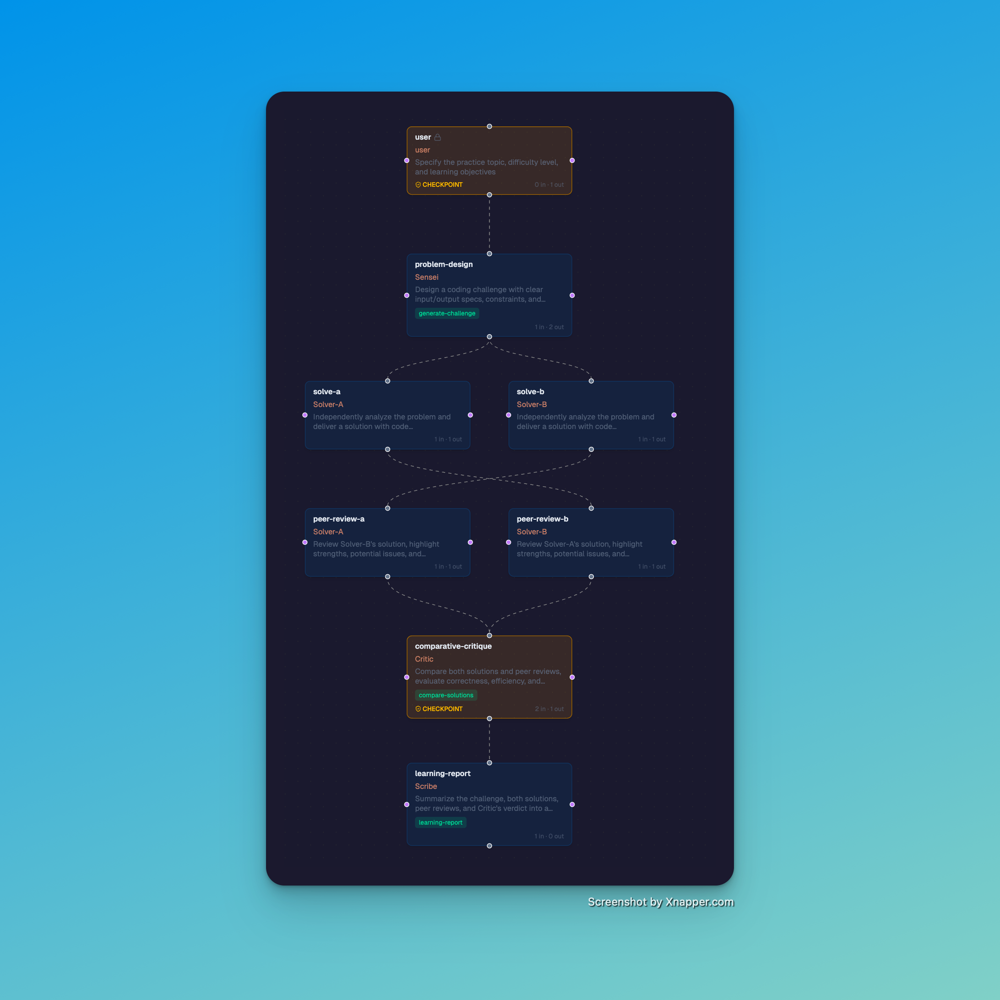
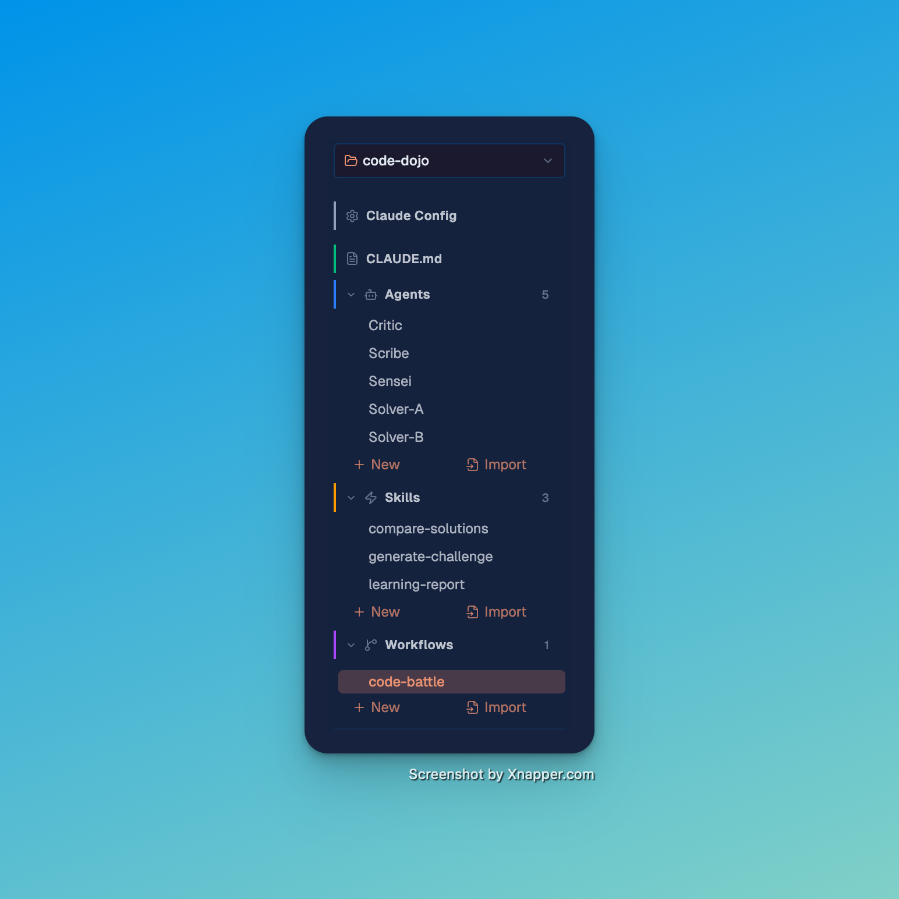
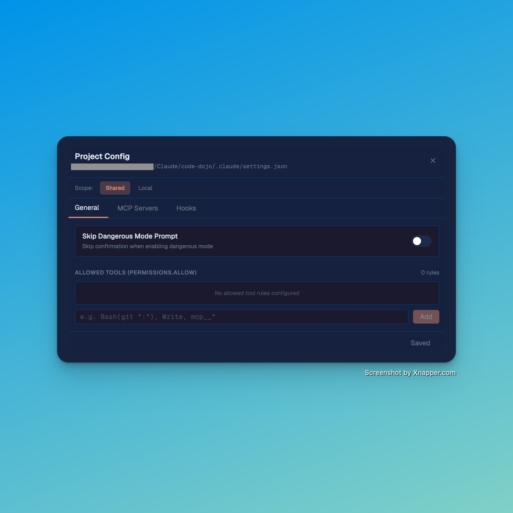

<div align="center">
  
  <h1>claude-studio</h1>
  <p><strong>Claude Code Agent Teams 的可视化编排平台。</strong></p>
  <p><em>通过直观的 DAG 编辑器设计、管理和执行多 Agent 工作流。</em></p>

  <p>
    <a href="https://www.npmjs.com/package/claude-code-studio"></a>
    <a href="https://www.npmjs.com/package/claude-code-studio"></a>
    <a href="https://github.com/androidZzT/claude-studio/stargazers"></a>
    <a href="LICENSE"></a>
    
  </p>

  <p>
    <a href="#功能特性">功能特性</a> &bull;
    <a href="#截图">截图</a> &bull;
    <a href="#快速开始">快速开始</a> &bull;
    <a href="#使用流程">使用流程</a> &bull;
    <a href="README.md">English</a>
  </p>
</div>

---

## 功能特性

- 🔀 **可视化工作流编辑器** — 拖拽式 DAG 编辑，4 种边类型（指派/回报/协作/双向）
- 🤖 **Agent 管理** — 创建/编辑/删除，9 个内置模板
- ⚡ **Skill 管理** — 创建 Skill 并绑定到 Agent 节点
- 🚀 **执行引擎** — 按拓扑序执行工作流，支持 Checkpoint 审批
- 🪄 **AI 生成** — 用自然语言描述，通过 claude -p 自动生成 Workflow/Agent/Skill
- 🔌 **MCP 和设置** — 可视化管理 MCP 服务器、Hook、权限
- 📦 **Plugin 导出** — 导出为标准 Claude Code Plugin 格式
- 🧠 **记忆检视** — 只读查看项目记忆，支持清理过期记忆
- 🎯 **CLAUDE.md 同步** — 保存工作流时自动同步到 CLAUDE.md
- 🌓 **主题切换** — 深色、浅色、跟随系统
- ⚙️ **项目配置** — 按项目管理 Shared 和 Local 配置

---

## 截图

<table>
  <tr>
    <td align="center"><strong>深色模式</strong></td>
    <td align="center"><strong>浅色模式</strong></td>
  </tr>
  <tr>
    <td></td>
    <td></td>
  </tr>
  <tr>
    <td align="center"><strong>工作流 DAG</strong></td>
    <td align="center"><strong>项目工作区</strong></td>
  </tr>
  <tr>
    <td></td>
    <td></td>
  </tr>
  <tr>
    <td align="center"><strong>节点编辑器</strong></td>
    <td align="center"><strong>项目配置</strong></td>
  </tr>
  <tr>
    <td></td>
    <td></td>
  </tr>
</table>

---

## 快速开始

```bash
npx claude-code-studio
```

自定义端口：

```bash
npx claude-code-studio --port 3200
```

### 开发模式

```bash
git clone https://github.com/androidZzT/claude-studio.git
cd claude-studio
npm install
npm run dev -- -p 3100
```

---

## 使用流程

claude-studio 是 `~/.claude/` 目录的 GUI —— 与 Claude Code 运行时读取的是同一个目录。你在 studio 中创建的一切都直接写入 `.claude/` 标准文件：

| 在 studio 中创建 | 保存为 | Claude Code 识别为 |
|---|---|---|
| Agent | `.claude/agents/name.md` | Agent 定义（可通过 `Agent` 工具调度） |
| Skill | `.claude/skills/name.md` | 斜杠命令（`/skill-name`） |
| Workflow | `.claude/workflows/name.yaml` | 团队编排蓝图 |
| CLAUDE.md 编辑 | `CLAUDE.md` | 项目指令 |
| 设置 | `.claude/settings.json` | MCP 服务器、Hook、权限 |

### 工作流程

1. **打开项目** — 指向任何包含 `.claude/` 的目录（或新建一个）
2. **创建 Agent** — 从 9 个内置模板或 AI 生成
3. **编排工作流** — 拖拽 Agent 到画布，用 4 种边类型连线
4. **绑定 Skill 和 MCP** — 从面板拖到 Agent 节点
5. **执行** — Run 执行，实时查看状态，审批 Checkpoint
6. **在 Claude Code 中使用** — 打开同一个项目目录，Agent/Skill/Workflow 即刻可用

### 与 CLAUDE.md 的联动

保存工作流时，claude-studio 会**自动同步**到 `CLAUDE.md`。这意味着 Claude Code 启动时自动看到你的团队结构、Agent 角色和工作流定义。你在 studio 中可视化设计团队，Claude Code 负责执行。

```
claude-studio (设计) → ~/.claude/ (文件) → Claude Code (运行)
```

---

## 架构

```
┌─────────────────────────────────┐
│  GUI (React + React Flow v12)   │
├─────────────────────────────────┤
│  Next.js API Routes             │
├─────────────────────────────────┤
│  ~/.claude/ (source of truth)   │
├─────────────────────────────────┤
│  Claude Code (runtime)          │
└─────────────────────────────────┘
```

技术栈: Next.js · React Flow v12 · Monaco Editor · TypeScript · Tailwind CSS · Lucide Icons

## 边类型

| 类型 | 样式 | 用途 |
|------|------|------|
| Dispatch (指派) | 灰色实线 | 任务分配，执行依赖 |
| Report (回报) | 青色虚线 | 结果反馈 |
| Sync (协作) | 紫色点线 | 同级协作 |
| Roundtrip (双向) | 青绿双箭头 | 双向指派+回报 |

## 许可证

MIT
